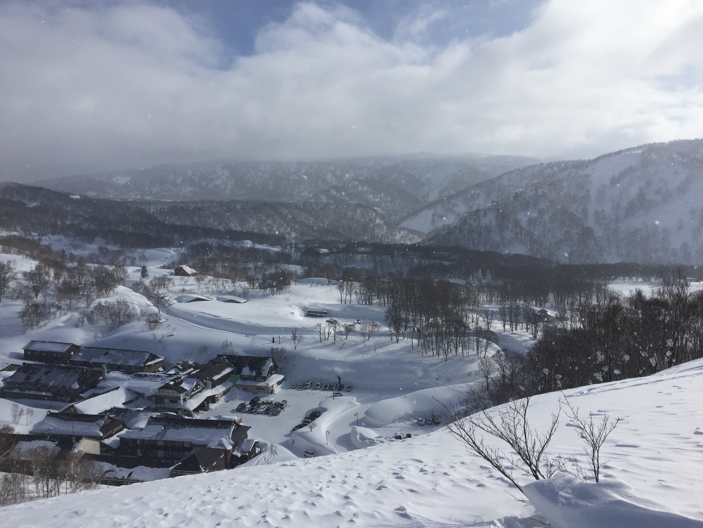

# Sukayu Seasonal Weather Observations Analysis

This project analyses various databases of historical weather observation data from the [JMA (Japan Meteorological Association)](https://www.jma.go.jp/jma/indexe.html) station at [Sukayu Onsen, Aomori, Japan](https://www.jma.go.jp/bosai/amedas/#area_type=offices&area_code=020000&amdno=31482&format=table1h&lang=en&elems=53600).

As one of the oldest official weather stations in Japan, and also at the foot of the Hakkōda Mountains, known to be one of the *snowiest places in the country*, we hope to glean some trends in the **effects of climate change on the area's winter mountain sport seasons**.

---

# What are some of the data in ”[Sukayu Winters Data](./outputs/Sukayu-Winters-Data.json)"

## "Scandi Seasons"

What we call "Scandi Seasons" here is inspired by a method used in Scandinavia to identify when the seasons started from a meteorological point of view (instead of astrological).

We can think of them as “meteorological seasons”, with parameters (*number of days to account for, and temperature thresholds*) adjusted for the particular setting.

We calculate 2 versions, one based on the daily mean temperature for 7 days, so:

- The First Day of Autumn is the first day that **the daily mean temperature remained below 10 °C for 7 consecutive days**.
- The First Day of Winter is the first day that **the daily mean temperature remained below  0 °C for 7 consecutive days**.
- The First Day of Spring is the first day that **the daily mean temperature remained above  0 °C for 7 consecutive days**.
- The First Day of Summer is the first day that **the daily mean temperature remained above 10 °C for 7 consecutive days**.

… and the other based on the average daily mean temperature across 7 days, so:

- The First Day of Autumn is the first day that **the average of following 7 days' daily mean temperature remained below 10 °C**.
- The First Day of Winter is the first day that **the average of following 7 days' daily mean temperature remained below  0 °C**.
- The First Day of Spring is the first day that **the average of following 7 days' daily mean temperature remained above  0 °C**.
- The First Day of Summer is the first day that **the average of following 7 days' daily mean temperature remained above 10 °C**.

## Snowfalls

- First and last snowfalls are simply the first time in the last quarter of a year, and the last day in the first quarter of the following year, when a snowfall greater than 0 cm was reported.

- “First and Last of Substance” are similar to the "Scandi Seasons", where we look for the **first and last time 3 days in a row of at least 5.0 cm snowfall** were recorded that season.

- “Season Total” is the sum of the seasons’ daily reported snowfall. (*Note that is different from snow depth. Snow compacts and melts, after all.*)

- “Days over N” gives a count of how many days (each) had snowfall reported over increments of 10 cm thresholds.

## Snow depths

- “Maximum depth” is the maximum reported snow depth that season.

- Dates of each instance when the snow depth was first reported to surpass multiples of 100 cm depths.

- “Fin” is date of the sad day after the last reported snow depth of the season. 

## Temps

We find or calculate the seasonal minima, maxima and averages (means) of the reported daily average, low and high temperatures, as well as the daily amplitude between low and high temperature (*which we calculate ourselves*).

## Winds
We find or calculate the seasonal minima, maxima and averages (means) of the daily amplitude between the average and gusting wind speeds (*which we calculate ourselves*).

---

# Some things to notice

- Until 2008, it was very rare, almost unheard of, to have 7 consecutive days in summer where the daily average temperature remained above 10 °C. In those cases, "**Scandi Summer**" never even started!

- In local media, the first snowfall visible on the mountains is often reported (*and we include similar “first reported snowfall” in our analysis*). However, the “**first snowfall of substance**”—which we define for our purposes as “the first time in a season when it snows at least 5 cm, at least 3 days in a row”—is much more significant and indicative of the start (*and end, in reverse*) of a snow season.

---

# How to install & run

This project currently is based in the Python programming language and requires familiarity with environment setup.
I will try to lightly document easy setup instructions eventually.